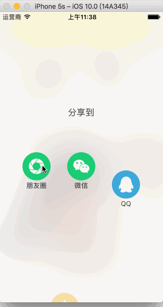

##自定义分享view

分享界面显示时按钮从屏幕下方弹出，带有弹簧效果
demo：


##usage
```
[LWSharedView show:self];
#pragma mark - sharedViewDelegate
-(void)sharedView:(LWSharedView *)sharedV didClickedItem:(NSInteger)index
{
    NSLog(@"按钮被点击 %ld",index);
}   
```
